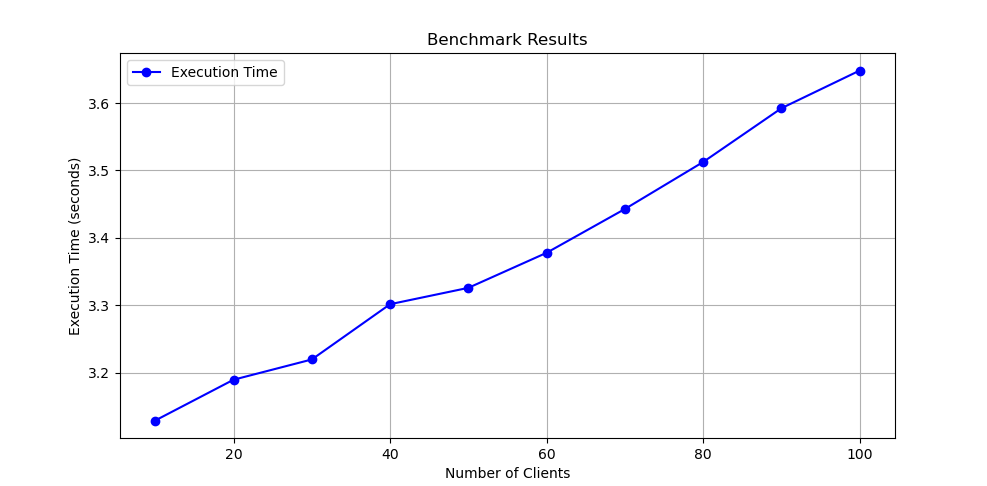
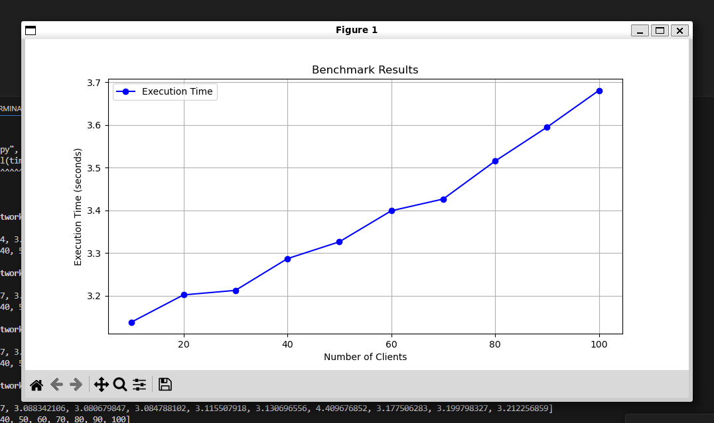
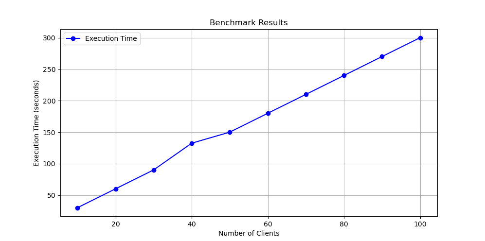

# Performance Analysis

## Multi-Threaded Execution Results

- **Extracted Execution Times (seconds):**  
  `[3.033437608, 3.046915889, 3.064965979, 3.09215076, 3.113365593, 3.151920728, 3.167947593, 3.186195566, 3.217608141, 3.240943514]`
- **Extracted Client Counts:**  
  `[10, 20, 30, 40, 50, 60, 70, 80, 90, 100]`

## Multi-Process Execution Results

- **Extracted Execution Times (seconds):**  
  `[3.039323987, 3.088342106, 3.080679847, 3.084788102, 3.115507918, 3.130696556, 4.409676852, 3.177506283, 3.199798327, 3.212256859]`
- **Extracted Client Counts:**  
  `[10, 20, 30, 40, 50, 60, 70, 80, 90, 100]`

## Single-Host Execution Results

- **Extracted Execution Times (seconds):**  
  `[30.03528892, 60.055779079, 90.083649507, 132.530335798, 150.107711303, 180.131355153, 210.13441504, 240.160207381, 270.276450538, 300.214706017]`
- **Extracted Client Counts:**  
  `[10, 20, 30, 40, 50, 60, 70, 80, 90, 100]`

