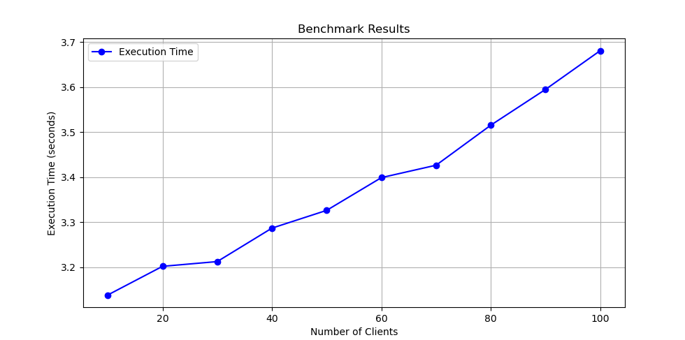

# Performance Analysis

## Multi-Threaded Execution Results

- **Extracted Execution Times (seconds):**  
  `[3.128951394, 3.189466232, 3.219523756, 3.301541939, 3.325838397, 3.377867947, 3.442864529, 3.512631134, 3.592456998, 3.648396683]`
- **Extracted Client Counts:**  
  `[10, 20, 30, 40, 50, 60, 70, 80, 90, 100]`

## Multi-Process Execution Results

- **Extracted Execution Times (seconds):**  
  `[3.138709672, 3.202288834, 3.212853453, 3.287117688, 3.326556876, 3.399247507, 3.426797441, 3.515698048, 3.595130444, 3.681214847]`
- **Extracted Client Counts:**  
  `[10, 20, 30, 40, 50, 60, 70, 80, 90, 100]`

## Single-Host Execution Results

- **Extracted Execution Times (seconds):**  
  `[30.03528892, 60.055779079, 90.083649507, 132.530335798, 150.107711303, 180.131355153, 210.13441504, 240.160207381, 270.276450538, 300.214706017]`
- **Extracted Client Counts:**  
  `[10, 20, 30, 40, 50, 60, 70, 80, 90, 100]`

**This implies that multi-thread performs very slightly better than multi-process while both of them are far much better than single host.**

